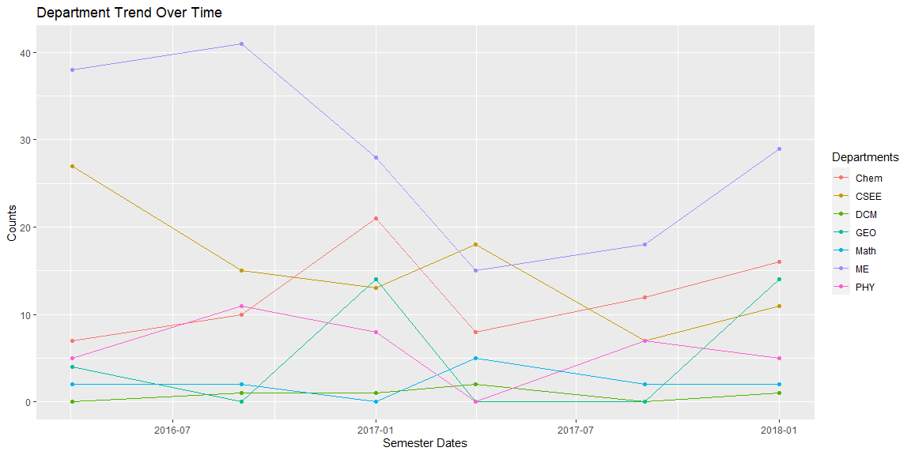

### R&CW: What is the growth trend over time by department?
The following chart shows the count trend over time for each department selected. Each line is plotted with points corresponding to dates and color coded for easier distinction. 


```r
library(tidyverse)
library(dplyr)
library(ggplot2)

dat <- read_csv("https://byuistats.github.io/M335/data/rcw.csv", 
                col_types = cols(Semester_Date = col_date(format = "%m/%d/%y"), Semester = col_factor(levels = c("Winter", "Spring", "Fall"))))
```


```r
ggplot(dat, aes(Semester_Date, Count, colour = Department)) +
  geom_line() +
  geom_point() +
  xlab("Semester Dates") +
  ylab("Counts") +
  ggtitle("Department Trend Over Time") + 
  labs(colour = "Departments")
```

<!-- -->

