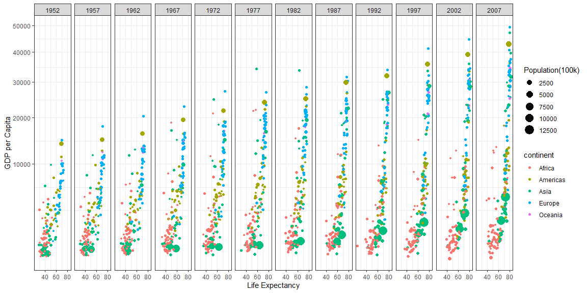

```r
library(tidyverse)
library(dplyr)
library(ggplot2)
library(gapminder)

## View the original data plot.
ggplot(data=gapminder, aes(x=year, y=gdpPercap, by=country)) + 
  geom_line(aes(color=continent)) +
  geom_line(data=gapminder[gapminder$country == "Kuwait",], aes(color=country), size=2)
```

<!-- -->

```r
## Remove Kuwait from the data frame.
gapminder2 <- gapminder[!gapminder$country == 'Kuwait',]

# View the new set without Kuwait.
View(gapminder2)

## Load ggplot2.

year_1952 <-  ggplot(data=gapminder2, aes(x=lifeExp, y=gdpPercap, by=country)) +
              geom_point(aes(color=continent, size = pop))  +
              guides(size = guide_legend(order = 1), color = guide_legend(order = 2)) +
              scale_y_continuous(trans = "sqrt") +
              labs(size = "Population(100k)", x = "Life Expectancy", y = "GDP per Capita") +
              theme_bw() 

year_1952
```

<!-- -->

