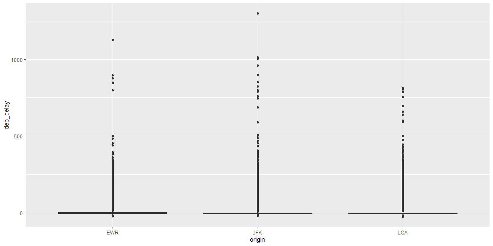

## Data Visualization


```r
# Use this R-Chunk to plot & visualize your data!

##Install reprex package for debugging help.

##View the flights dataframe.
View(flights)

##Filter through the data so that only JFK, LGA, and EWR show up.
newFlight <- flights %>%
                filter(dep_time <=1200)

ggplot(data = newFlight, mapping = aes(x = origin, y = dep_delay)) +
  geom_boxplot()
```

<!-- -->

## Conclusions
