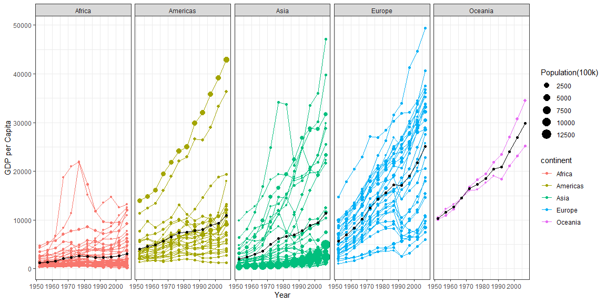

```r
##Remove Kuwait from the dataframe.
gap2 <- filter(gapminder, country != "Kuwait")

##Verify the data was removed.
View(gap2)

##Create the mean.
newgap <- gap2 %>%
          group_by(year, continent) %>%
          mutate(mean = weighted.mean(gdpPercap))

##Create the plot.
ggplot(data = newgap, aes(x = year, y = gdpPercap, by =country)) +
  geom_line(aes(color = continent)) +
  geom_point(mapping = aes(x = year, y = gdpPercap, color=continent, size = pop/100000)) +
  geom_point(data = newgap, mapping = aes(x= year, y= mean, by= continent)) +
  geom_line(data= newgap, mapping = aes(x= year, y= mean, by= continent)) +
  guides(size = guide_legend(order = 1), color = guide_legend(order = 2)) +
  labs(size = "Population(100k)", x = "Year", y = "GDP per Capita") +
  theme_bw() +
  facet_wrap(~continent, nrow = 1)
```

<!-- -->


## Conclusions

This was extremely difficult because it took me forever to get that you'd have to filter the data before creating the graph. Although the new mean line would be added, I recently learned that you could add multiple geom_lines and geom_points to a graph. This whole time I was trying to make sure they would fit in the arguments of the original two, but that was a mistake. There's a lot to learn still and I'm trying hard to get how the orders go.
