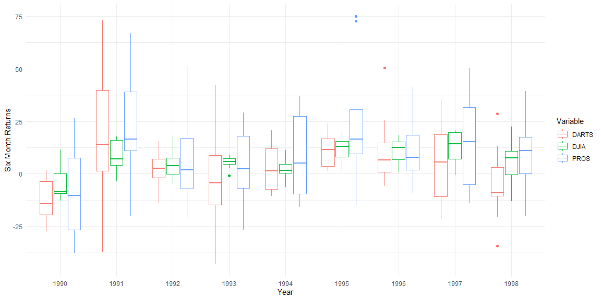

```r
# Use this R-Chunk to import all your datasets!
##Load the data from Github.
stock_data <- read_csv(url("https://github.com/byuistats/data/raw/master/Dart_Expert_Dow_6month_anova/Dart_Expert_Dow_6month_anova.csv"))
```

## Data Wrangling


```r
# Use this R-Chunk to clean & wrangle your data!

##First, separate the contest_period into separate columns.
stock_data <- stock_data %>%
  separate(contest_period, into = c("begin_date", "end_date"), sep = "-")
##Second, separate the end date to month and year.
stock_data <- stock_data %>%
  separate(end_date, into = c("end_month", "end_year"), sep = -4)
##Third, make sure that February mispells get replaced.
stock_data$end_month <- replace(stock_data$end_month, stock_data$end_month == "Febuary", "February")
##Make sure that December mispells get replaced.
stock_data$end_month <- replace(stock_data$end_month, stock_data$end_month == "Dec", "December")
##Dismiss the beginning column.
stock_data <- stock_data %>%
  select(end_month, end_year, variable, value)
##Save  your rds data.
saveRDS(stock_data, "tidy_data.rds")
```

## Data Visualization
The data shows how the different quartiles provided by the boxplot graphing option. Points throughout the years and summarised through color based on the variable.

```r
stock_plot <- 
  ggplot(stock_data, aes(x=end_year, y=value, color = variable)) + 
  geom_boxplot(aes(color = variable)) +
  theme_minimal() +
  xlab("Year") +
  ylab("Six Month Returns") +
  labs(color = "Variable")

stock_plot
```

<!-- -->


```r
##Filter data so only those matching the DJIA variable appear.
djia_table <- filter(stock_data, variable == "DJIA")
##Create a summary of the djia table.
djia_table <- summarise(djia_table, end_month, end_year, value)
##Pivot the table.
djia_table <- djia_table %>% pivot_wider(names_from = end_year, values_from = value)
djia_table <- djia_table[order(djia_table$end_month),]
##Display final table.
djia_table
```

```
## # A tibble: 13 x 10
##    end_month `1990` `1991` `1992` `1993` `1994` `1995` `1996` `1997` `1998`
##    <chr>      <dbl>  <dbl>  <dbl>  <dbl>  <dbl>  <dbl>  <dbl>  <dbl>  <dbl>
##  1 April       NA     16.2   10.6    5.8    0.5   12.8   14.8   15.3   22.5
##  2 August      -2.3    4.4   -0.3    7.3    1.5   15.3    0.6    8.3  -13.1
##  3 Dec.        NA     NA     NA      8     NA     NA     NA     NA     NA  
##  4 December    -9.3    6.6    0.2   NA      3.6    9.3   15.5   -0.7   NA  
##  5 February    NA     11      8.6    2.5    5.5    3.2   15.6   20.1   10.7
##  6 January     NA     -0.8    6.5   -0.8   11.2    1.8   15     19.6   -0.3
##  7 July        11.5    7.6    4.2    3.7   -5.3   19.6    1.3   20.8    7.1
##  8 June         2.5   17.7    3.6    7.7   -6.2   16     10.2   16.2   15  
##  9 March       NA     15.8    7.2    9      1.6    7.3   18.4    9.6    7.6
## 10 May         NA     17.3   17.6    6.7    1.3   19.5    9     13.3   10.6
## 11 November   -12.8   -3.3   -2.8    4.9   -0.3   13.1   15.1    3.8   NA  
## 12 October     -8.5    4.4   -5      5.7    6.9    8.2    7.2    3     NA  
## 13 September   -9.2    3.4   -0.1    5.2    4.4   14      5.8   20.2  -11.8
```

